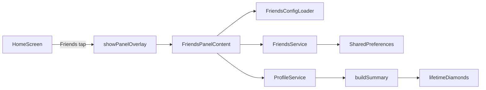

# Issue-9: Friends Page – Implementation Plan

## Scope

- Friends panel opened from the home screen Friends button (overlay, same pattern as Achievements).
- Grid of 12 animals; order and diamond cost per animal from JSON config.
- Locked animals greyed out; user spends diamonds to "free" them; freed animals show a short happy/jump animation.
- **Popup once only:** "Diamonds are needed to free the animals." (shown only on first panel open; persist `hintDismissed` in FriendsState.)
- **Confirm when freeing:** Dialog: "[Animal] will be freed for X diamonds?" with Cancel / Confirm.
- **Not enough diamonds:** Show toast (SnackBar): "Not enough diamonds."
- **Animation:** Flutter only (`AnimationController` + `Tween`); no Lottie.
- Persist freed animals locally (SharedPreferences); diamond balance = lifetime diamonds (from profile summary) minus cost of all freed animals.

## Architecture

- **Diamond source:** Existing [ProfileService.buildSummary](app/lib/services/profile_service.dart) returns `ProfileSummary.lifetimeDiamonds` (sum of `totalDiamonds` per quiz type). No change to profile or quiz progress.
- **Spending:** Track only which animals are freed. "Spent" = sum of `diamondCost` (from config) for each freed id. **Available diamonds** = `lifetimeDiamonds - spent`. No separate "wallet" deduction; freeing an animal just adds its id to persisted state.

---

## 1. Data and config

**Friends config** – `app/assets/data/config/friends.json`  

- Single array of 12 entries in **display order**. Each entry: `id` (string), `image` (asset path or filename under `assets/images/friends/`), `diamondCost` (int).  
- Example: `[{ "id": "bear", "image": "bear", "diamondCost": 10 }, ...]`  
- Load via `rootBundle.loadString('assets/data/config/friends.json')` in a small loader (e.g. `lib/services/friends_config_loader.dart`), parse to a list of model objects (e.g. `FriendAnimalDefinition`).

**Friends state (persisted)**  

- Which animals are freed and whether the hint was shown: `FriendsState { Set<String> freedAnimalIds, bool hintDismissed }` in `lib/models/friends_state.dart`.  
- **FriendsService** in `lib/services/friends_service.dart`: load/save `FriendsState` with SharedPreferences (key e.g. `friends_state`), same pattern as [AchievementService](app/lib/services/achievement_service.dart). When user dismisses the first-time popup, set `hintDismissed: true` and persist.  
- No change to [ProfileState](app/lib/models/profile_state.dart) or quiz progress.

---

## 2. Assets

- **Directory:** `app/assets/images/friends/`  
- **Content:** 12 square animal images (e.g. `bear.png`, `lion.png`). Use placeholders if assets are not ready; names must match `image` in config.  
- **pubspec:** Add `assets/images/friends/` under `flutter.assets` in [app/pubspec.yaml](app/pubspec.yaml).

---

## 3. Friends panel UI

**Entry point**  

- In [home_screen.dart](app/lib/screens/home_screen.dart), replace the Friends nav callback from `_showPanel('Friends', 'Animal friend grid – coming soon')` with a `_showFriendsPanel()` that calls `showPanelOverlay(context, title: 'Friends', body: const FriendsPanelContent())`.

**FriendsPanelContent** (new: `lib/screens/friends_panel_content.dart`)  

- StatefulWidget. In `initState` (or first build): load config (friends_config_loader), load profile and call `ProfileService.instance.buildSummary(profile)` for `lifetimeDiamonds`, load `FriendsService.instance.loadState()` for `freedAnimalIds` and `hintDismissed`.  
- Compute `spent = sum of definition.diamondCost for id in freedAnimalIds`; `availableDiamonds = lifetimeDiamonds - spent`.  
- **Popup (once only):** After data is loaded, if `!state.hintDismissed`, show a dialog with text "Diamonds are needed to free the animals" and a dismiss button; on dismiss set `hintDismissed: true` and persist via FriendsService. On subsequent panel opens, do not show the popup.  
- **Grid:** Scrollable grid (e.g. `GridView` or `Wrap`) of 12 items in config order. Each item: image (from `assets/images/friends/${definition.image}.png` or path from config), label/name if desired.  
- **Locked:** Animal id not in `freedAnimalIds` → show image with `ColorFiltered(colorFilter: ColorFilter.mode(Colors.grey, BlendMode.saturation))` (or greyscale filter) and show diamond cost badge.  
- **Freed:** Animal id in `freedAnimalIds` → show full-color image; tap does nothing (or optional tooltip "Already freed").  
- **Tap locked:** If `availableDiamonds >= definition.diamondCost`, show a **confirm dialog**: "[Animal] will be freed for X diamonds?" with Cancel / Confirm. On confirm: add id to `freedAnimalIds`, save via FriendsService, update local state, trigger **animation** on that grid cell (see below), then refresh. If `availableDiamonds < definition.diamondCost`, show a **toast** (SnackBar): "Not enough diamonds."

---

## 4. Free animation (Flutter only)

- When user frees an animal, that grid tile plays a short "happy / jumping" animation.  
- **Flutter animation only:** use `AnimationController` + `Tween` (e.g. 300–500 ms) on the tile widget: scale up then back (1.0 → 1.2 → 1.0) and/or vertical offset (bounce). No Lottie or third-party animation packages.  
- Trigger: after `FriendsService.saveState(updatedState)` and `setState`, the tile for that id can be wrapped in a small stateful widget that runs the animation once when it becomes "freed" (e.g. pass `justFreedId == id` and run controller.forward() in didUpdateWidget when it turns true).

---

## 5. File list (implementation order)

| Step | File                                      | Action                                                                                 |
| ---- | ----------------------------------------- | -------------------------------------------------------------------------------------- |
| 1    | `app/assets/data/config/friends.json`     | Add config: 12 animals, id, image, diamondCost.                                        |
| 2    | `app/assets/images/friends/`              | Create dir; add 12 placeholder or real square images.                                  |
| 3    | `app/pubspec.yaml`                        | Register `assets/images/friends/`.                                                     |
| 4    | `lib/models/friends_state.dart`           | New: FriendsState (freedAnimalIds, hintDismissed) + fromJson/toJson.                   |
| 5    | `lib/services/friends_service.dart`       | New: load/save FriendsState with SharedPreferences.                                    |
| 6    | `lib/services/friends_config_loader.dart` | New: load and parse friends.json to List of definitions.                               |
| 7    | `lib/screens/friends_panel_content.dart`  | New: grid, locked/freed UI, tap-to-free, popup once, confirm dialog, toast, animation. |
| 8    | `lib/screens/home_screen.dart`            | Replace Friends callback with _showFriendsPanel() using FriendsPanelContent.           |

---

## 6. Out of scope / optional

- **Lottie:** Not in scope; Flutter AnimationController only.  
- **Sound:** Not in use case; omit unless requested.

---

## 7. Verification

- Open Friends from home → panel opens; **first time only:** popup "Diamonds are needed to free the animals" appears; dismiss popup (hintDismissed persisted); grid shows 12 animals in config order, all locked (greyed) with cost badges. **Second open:** no popup.  
- With enough diamonds: tap locked animal → **confirm dialog** "[Animal] will be freed for X diamonds?" → Confirm → animal frees, Flutter jump animation plays, tile becomes full color; available diamonds decrease; reopen panel and state persists.  
- With insufficient diamonds: tap locked animal → **toast (SnackBar)** "Not enough diamonds."; no free.

